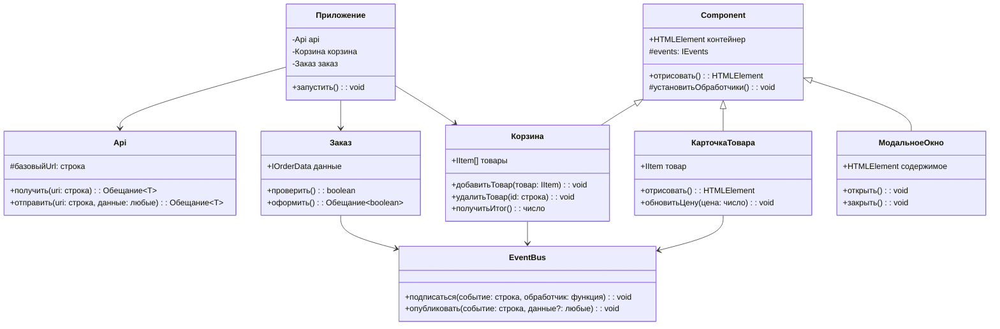

# Проектная работа "Веб-ларек"

Стек: HTML, SCSS, TypeScript, Webpack

## Структура проекта

```
src/
├── components/           # Компоненты приложения
│   ├── base/            # Базовые классы
│   ├── models/          # Модели данных
│   └── ...              # Остальные компоненты
├── scss/                # Стили
├── utils/               # Утилиты и константы
└── index.ts             # Точка входа приложения
```

### Важные файлы:
- `src/index.ts` — точка входа приложения
- `src/models/ProductTypes.ts` — типы данных и интерфейсы
- `src/components/base/` — базовые классы (Component, EventBus, Api)
- `src/utils/constants.ts` — константы приложения
- `src/utils/utils.ts` — вспомогательные функции

## Установка и запуск

1. Установите зависимости:
```bash
npm install
# или
yarn
```

2. Создайте файл `.env` в корне проекта с переменной окружения:
```
API_ORIGIN=https://larek-api.nomoreparties.co
```

3. Запустите сервер разработки:
```bash
npm run start
# или
yarn start
```

Приложение будет доступно по адресу: [http://localhost:3000](http://localhost:3000)

## Сборка для продакшена

```bash
npm run build
# или
yarn build
```

Собранная версия приложения будет находиться в папке `dist/`.


## Основные модели данных

### Товар (Item)
```typescript
export interface IItem {
    id: string;
    itemIndex: number;
    category: TItemCategory;
    description: string;
    image: string;
    price: TItemPrice;  // number | null
    title: string;
}
```

### Категории товаров
```typescript
export type TItemCategory = 'софт-скил' | 'хард-скил' | 'другое' | 'кнопка' | 'дополнительное';

export const categoryType: Record<TItemCategory, string> = {
    'софт-скил': 'soft',
    'хард-скил': 'hard',
    'другое': 'other',
    'кнопка': 'button',
    'дополнительное': 'additional',
};
```

### Корзина (Basket)
```typescript
export interface IBasket {
    items: IItem[];
    addItem(item: IItem): void;
    alreadyInBasket(itemId: string): boolean;
    clear(): void;
    getTotal(): number;
    getCount(): number;
    removeItem(itemId: string): void;
}
```

### Заказ (Order)
```typescript
export type TPaymentType = 'card' | 'cash' | null;

export interface IOrderData {
    address: string;
    email: string;
    payment: TPaymentType;
    phone: string;
    total: number;
    items: string[];  // Массив ID товаров
}

// Ответ сервера на заказ
export interface IOrderResponse {
    id?: string;
    total?: number;
    error?: string;
    code?: number;
}
```

### Валидация
```typescript
export interface IValidateData {
    valid: boolean;
    errors: string;
}
```

### API
```typescript
export type ApiPostMethods = 'POST' | 'PUT' | 'DELETE' | 'PATCH';

export interface IApi {
    readonly baseUrl: string;
    get<T>(uri: string): Promise<T>;
    post<T>(uri: string, data: object, method?: ApiPostMethods): Promise<T>;
}
```
## Архитектура приложения

Приложение построено по архитектурному паттерну MVP (Model-View-Presenter) с использованием событийной модели для обмена данными между компонентами.

### Основные слои:

1. **Модель (Model)**
   - `BasketModel` - управляет состоянием корзины
   - `Showcase` - управляет списком товаров
   - `Order` - управляет данными заказа

2. **Представление (View)**
   - `Basket` - отображает содержимое корзины
   - `ProductCard` - карточка товара в каталоге
   - `CardPreview` - детальный просмотр товара
   - `OrderFormView` - форма заказа
   - `ContactsFormView` - форма контактов
   - `ModalDialog` - модальное окно
   - `MainPage` - главная страница

3. **Презентер (Presenter)**
   - `index.ts` - центральный файл, связывающий модели и представления через события

4. **Сервисы**
   - `ApiClient` - обертка для работы с API
   - `EventBus` - шина событий для обмена сообщениями

### Взаимодействие компонентов:

1. Пользователь взаимодействует с интерфейсом (нажимает кнопки, заполняет формы)
2. Представление генерирует событие через `EventBus`
3. Обработчик события в `index.ts` обновляет модель
4. Модель уведомляет об изменениях через события
5. Представления обновляются в ответ на события

### Базовый код

#### Класс Api
Содержит в себе базовую логику отправки запросов. В конструктор передается базовый адрес сервера и опциональный объект с заголовками запросов.
Методы: 
- `get` - выполняет GET запрос на переданный в параметрах ендпоинт и возвращает промис с объектом, которым ответил сервер
- `post` - принимает объект с данными, которые будут переданы в JSON в теле запроса, и отправляет эти данные на ендпоинт переданный как параметр при вызове метода. По умолчанию выполняется `POST` запрос, но метод запроса может быть переопределен заданием третьего параметра при вызове.

#### Класс EventEmitter
Брокер событий позволяет отправлять события и подписываться на события, происходящие в системе. Класс используется в презентере для обработки событий и в слоях приложения для генерации событий.  
Основные методы, реализуемые классом описаны интерфейсом `IEvents`:
- `on` - подписка на событие
- `emit` - инициализация события

#### Класс Component
Класс является дженериком и родителем всех компонентов слоя представления  (кроме карточек). В дженерик принимает тип объекта, в котором данные будут передаваться в метод render для отображения данных в компоненте. В конструктор принимает элемент разметки, являющийся основным родительским контейнером компонента. Содержит метод render, отвечающий за сохранение полученных в параметре данных в полях компонентов через их сеттеры, возвращает обновленный контейнер компонента.

`export abstract class Component<T>`
- `constructor(protected readonly container: HTMLElement)`
- `changeClassState(
        element: HTMLElement, 
        className: string, 
        state?: boolean
	): void` - Изменяет состояние CSS класса элемента

- `changeDisabledState(element: HTMLElement, isDisabled: boolean): void` - Управляет состоянием disabled атрибута
- `render(data?: Partial<T>): HTMLElement` - получение данных и отрисовка содержимого

### Слой данных

#### Класс Showcase
Класс отвечает за хранение и логику работы с данными карточек представленных на витрине.

`export class Showcase implements IShowcase`

- `constructor(events: IEvents)` - Инициализирует экземпляр витрины, принимает экземпляр шины событий для уведомления об изменениях
- `set items(items: IItem[])` - Устанавливает массив товаров на витрине, уведомляет подписчиков об изменении ассортимента
- `get items(): IItem[]` - Возвращает текущий список товаров на витрине
- `getItem(itemId: string): IItem` - Находит и возвращает товар по его идентификатору

#### Класс Basket
Класс отвечает за хранение ништяков, попавших в корзину.

```typescript
export class Basket implements IBasket 
```

- `constructor(events: IEvents)` - Создает экземпляр корзины и настраивает обработчики событий
- `get items(): IItem[]` - Возвращает массив товаров, находящихся в корзине
- `addItem(item: IItem): void` - Добавляет товар в корзину и обновляет счетчик
- `removeItem(itemId: string): void` - Удаляет товар из корзины по его идентификатору
- `alreadyInBasket(itemId: string): boolean` - Проверяет наличие товара в корзине
- `getTotal(): number` - Рассчитывает общую стоимость всех товаров в корзине
- `getCount(): number` - Возвращает общее количество товаров в корзине
- `clear(): void` - Очищает корзину, удаляя все товары

#### Класс Order
Класс отвечает за хранение информации, необходимой для оформления заказов.

`export class Order implements IOrder`

- `constructor(events: IEvents)` - Создает экземпляр заказа с шиной событий для уведомлений
- `clear(): void` - Очищает все данные заказа, сбрасывая значения полей в начальное состояние
- `set id(value: string): void` - Устанавливает уникальный идентификатор заказа
- `set address(value: string): void` - Устанавливает адрес доставки заказа
- `set phone(value: string): void` - Устанавливает контактный телефон для заказа
- `set email(value: string): void` - Устанавливает email для уведомлений о заказе
- `set payment(value: TPaymentType): void` - Устанавливает способ оплаты ('card' или 'cash')
- `get address(): string` - Возвращает сохраненный адрес доставки
- `get phone(): string` - Возвращает сохраненный контактный телефон
- `get email(): string` - Возвращает сохраненный email
- `get payment(): TPaymentType` - Возвращает выбранный способ оплаты

- `validateOrderForm( msg: string)` - валидатор для формы с адресом
- `validateContactForm(msg: string)` - валидатор для формы с телефоном
- `setFieldData<T extends keyof IOrderData>(field: T, value: IOrderData[T])` - принимает и сохраняет данные ордера
- `getOrderData()` - возвращает все данные ордера

### Слой представления
Все классы представления отвечают за отображение внутри контейнера (DOM-элемент) передаваемых в них данных.\

#### Класс Modal
Реализует модальное окно. Особенность в том, что в приложении только один экземпляр этого класса. и в нём отрисовываются различные два варианта форм и одна неформа.\

```typescript
export class Modal<IModalContent> extends Component<IModalContent>
```

Этот класс предоставляет методы `open` и `close` для управления отображением модального окна. Устанавливает слушатели на клавиатуру, для закрытия модального окна по Esc, на клик в оверлей и кнопку-крестик для закрытия попапа.

- `constructor(container: HTMLElement, events: IEvents)` - Конструктор принимает контейнер, в котором будет отображаться модальное окно, и экземпляр `EventEmitter` для обработки событий

#### Класс FormView
Обобщённый класс формы. Отрисовывается внутри класса Modal./ 
Содержит кнопку Submit и элементы ввода Input. Генерирует сообщения при вводе информации пользователем

```typescript
export class FormView<T> extends Component<Partial<T> & IFormState>
```

- `constructor(protected _form: HTMLFormElement, protected events: IEvents)` - Инициализирует форму, настраивает обработчики событий
- `set valid(value: boolean): void` - Устанавливает валидность формы и обновляет UI
- `set errors(message: string): void` - Устанавливает сообщение об ошибке и отображает его пользователю

#### Класс ContactsFormView

```typescript
export class ContactsFormView extends FormView<IOrderData>
```

- `constructor(container: HTMLFormElement, events: IEvents)` - Инициализирует форму контактов, настраивает валидацию полей
- `set email(value: string): void` - Устанавливает значение email в соответствующее поле формы
- `set phone(value: string): void` - Устанавливает значение телефона в соответствующее поле формы

#### Класс SuccessView
Реализация содержимого окошка с результатом оформления заказа

```typescript
export class SuccessView extends Component<ISuccessContent>
```

- `constructor(container: HTMLElement, protected events: IEvents)` - Инициализирует представление успешного заказа, настраивает обработчики событий
- `set total(value: number): void` - Устанавливает общую сумму заказа и обновляет отображение

#### Класс BasketView
Список карточек в корзине

```typescript
export class BasketView<IBasketContent> extends Component<IBasketContent>
```

- `constructor(container: HTMLElement, protected events: IEvents)` - Инициализирует представление корзины, настраивает обработчики событий
- `set items(items: HTMLElement[]): void` - Обновляет отображение списка товаров в корзине
- `set total(price: number): void` - Устанавливает общую стоимость товаров в корзине и обновляет отображение

#### Класс CardView
Обобщенный класс карточки товара. От него наследуются классы карточек
- CardBasket
-CardShowcase
- CardPreview

```typescript
export class CardView extends Component<IItem>
```

- `constructor(protected container: HTMLElement, events: IEvents)` - Базовый конструктор карточки товара
- `set category(value: TItemCategory): void` - Устанавливает категорию товара, что влияет на цветовое оформление
- `set image(value: string): void` - Устанавливает URL изображения товара
- `set price(value: number | null): void` - Устанавливает цену товара (null означает, что товар нельзя купить)
- `set description(value: string): void` - Устанавливает описание товара
- `set id(value: string): void` - Устанавливает уникальный идентификатор товара
- `set title(value: string): void` - Устанавливает название товара
- `set itemIndex(value: number): void` - Устанавливает порядковый номер товара в корзине
- `set inBasket(value: boolean): void` - Управляет отображением состояния "в корзине"


#### Класс CardPreview
Вид карточки в окне предпросмотра

```typescript
export class CardPreview extends CardView
```

- `constructor(container: HTMLElement, events: IEvents)` - Инициализирует карточку предпросмотра товара
- `set description(value: string): void` - Устанавливает описание товара в карточке предпросмотра
- `set image(value: string): void` - Устанавливает изображение товара в карточке предпросмотра

#### Класс CardBasket
Вид карточки корзине

```typescript
export class CardBasket extends CardView 
```

- `constructor(protected container: HTMLElement, events: IEvents)` - констуктор

#### Класс CardShowcase Вид карточки на витрине

export class CardShowcase extends CardView 

- `constructor(protected container: HTMLElement, events: IEvents)` - констуктор


#### Класс OrderFormView

export class OrderFormView extends FormView<IOrderData> 

- `constructor(container: HTMLFormElement, events: IEvents)` -
- `set address(value: string)` -
- `set payment(method: TPaymentType)` -

#### Класс AppPage 
Главная страница 

export class AppPage extends Component<IPageData>

- `constructor(container: HTMLElement, events: IEvents)` - конструктор
- `set galleryItems(items: HTMLElement[])` - сеттер для карточек
- `set basketCount( value: number)` - сеттер для количества ништяков в корзине
- `set scrollLocked(isLocked: boolean)` - Блокирует или разблокирует прокрутку страницы (например, при открытии модального окна)

#### Класс AppApi общение с сервером
Принимает в конструктор экземпляр класса Api и предоставляет методы реализующие взаимодействие с бэкендом сервиса.

- `constructor(baseApi: IApi)`
- `getShowcase(): Promise<IItem[]>` - возращает все доступные карточки
- `getItemById(id: string): Promise<IItem>` - возвращает одну карточку её id
- `postOrder(order: IOrderData, items: IItem[], cost: number): Promise<IOrderResponse>` - отправляет на сервер данные заказа и получает потдверждение этого заказа

## Взаимодействие компонентов
Код, описывающий взаимодействие представления и данных между собой находится в файле `index.ts`, выполняющем роль презентера.\
Взаимодействие осуществляется за счет событий генерируемых с помощью брокера событий и обработчиков этих событий, описанных в `index.ts`\
В `index.ts` сначала создаются экземпляры всех необходимых классов, а затем настраивается обработка событий.

### События изменения данных (генерируются классами моделями данных)
- `order: contactsForm NewData` - новые данные для contactsForm из order
- `order: orderForm NewData` - новые данные для orderForm из order

### События, возникающие при взаимодействии пользователя с интерфейсом (генерируются классами, отвечающими за представление)

здесь не всё, пока некогда писать

- `formView: contactsForm.submit` - нажата кнопка **Оплатить** в contactsForm
- `formView: orderForm.submit` - нажата кнопка **Далее** в orderForm
- `basketView: showOrderForm` - нажата кнопка **Оформить** в корзине
- `formView: orderForm.change` - изменен адрес (formView) или способ оплаты (orderFormView) в orderForm
- `formView: contactsForm.change` - изменен телефон или email в contactsForm

- `CardPreview: move_item_to_basket` - нажата кнопка **В корзину** в предпросмотре карточки
- `ProductCard: show_preview` - кликнули по карточке на витрине
- `CardBasket: delete_from_basket` - в корзинной карточке нажали кнопку удаления

- `modal: page.scrollLocked` - блокировка/разблокировка прокрутки при открытии/закрытии модалки
- `page: openBasket` - нажали изображение корзины на главной странице
- `successView: submit` - нажали кнопку **За новыми покупками** в successView


## 📊 Диаграмма архитектуры приложения



### Описание компонентов

1. **Базовый компонент (Component)**
   - Базовый класс для всех компонентов интерфейса
   - Содержит методы для отрисовки и управления DOM

2. **Шина событий (EventBus)**
   - Централизованная система событий
   - Позволяет компонентам обмениваться сообщениями

3. **API клиент (Api)**
   - Отвечает за взаимодействие с бэкендом
   - Инкапсулирует HTTP-запросы

4. **Карточка товара (ProductCard)**
   - Отображает информацию о товаре
   - Управляет состоянием цены

5. **Корзина (Basket)**
   - Управляет списком выбранных товаров
   - Считает общую стоимость

6. **Заказ (Order)**
   - Отвечает за оформление заказа
   - Валидирует данные формы

7. **Модальное окно (Modal)**
   - Базовый компонент для модальных окон
   - Управляет отображением контента

8. **Приложение (App)**
   - Главный класс приложения
   - Координирует работу всех компонентов

> **Примечание:** Для отображения диаграммы на GitHub убедитесь, что файл сохранен с расширением .md и поддерживается рендеринг Mermaid.